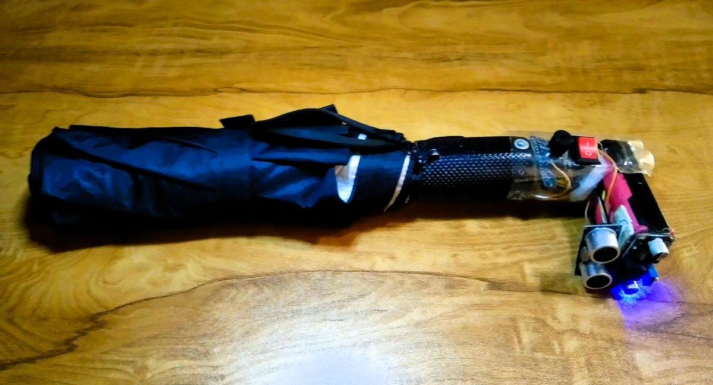
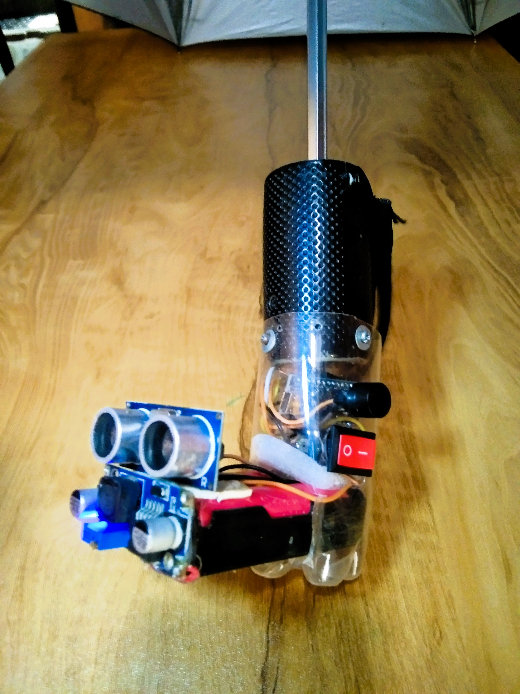

## ☂️ UmbraVision: Your Smart Companion in Every Weather

**UmbraVision** is a smart umbrella equipped with an ultrasonic sensor, Arduino Nano, and buzzer, designed to assist users by detecting nearby obstacles and providing audible feedback. Powered by a battery and controlled with a switch, UmbraVision enhances safety and convenience for its users.

---

### Features:
- **Ultrasonic Obstacle Detection**: ⚠️ Alerts the user when obstacles are detected within a predefined range.
- **Audible Feedback**: 🔊 A buzzer provides sound alerts for proximity warnings.
- **Easy Operation**: ⚡ Controlled with a simple on/off switch.
- **Compact and Portable**: 💼 Built with an **Arduino Nano** for a lightweight and efficient design.
- **Rechargeable Battery**: 🔋 Ensures portability and longer usage.

---

### Project Showcase

#### 📷 Image 1: Complete Setup  
  

#### 📷 Image 2: Components Breakdown  
  

**Key Components**:  
1. **Ultrasonic Sensor (HC-SR04)**: 📏 Detects the distance to obstacles.  
2. **Buzzer**: 🔔 Provides sound alerts.  
3. **Switch**: 🕹️ Controls the power supply.  
4. **Arduino Nano**: 💻 Microcontroller to process sensor input and control outputs.  
5. **Battery**: 🔋 Powers the system.  
6. **Casing**: 🧳 A lightweight plastic bottle body securely holds all components.  

---

### 🎥 Video Demonstration  
Watch UmbraVision in action! 🎬

https://github.com/user-attachments/assets/32b19984-b11d-408a-b18a-9ea88229f774

---

### How It Works  
1. The **ultrasonic sensor** continuously measures the distance to nearby obstacles. 📡  
2. If an object is detected within **90 cm**, the **buzzer** is triggered to alert the user. 📢  
3. The **switch** controls the system’s power, allowing for easy operation. 🔌  
4. The **Arduino Nano** processes the sensor data and activates the buzzer accordingly. 🤖  

---

### Future Enhancements  
- **Lighting Assistance**: 💡 Integrate LED lights for visibility in low-light conditions.  
- **Bluetooth Connectivity**: 📱 Send alerts or notifications to smartphones.  

---

### Setup Instructions  
1. Assemble the components as shown in the images. 🔧  
2. Upload the Arduino code (see the `umbraVision.ino` file). 💻  
3. Power the system using the rechargeable battery. 🔋  
4. Use the switch to activate the system. ⚡  